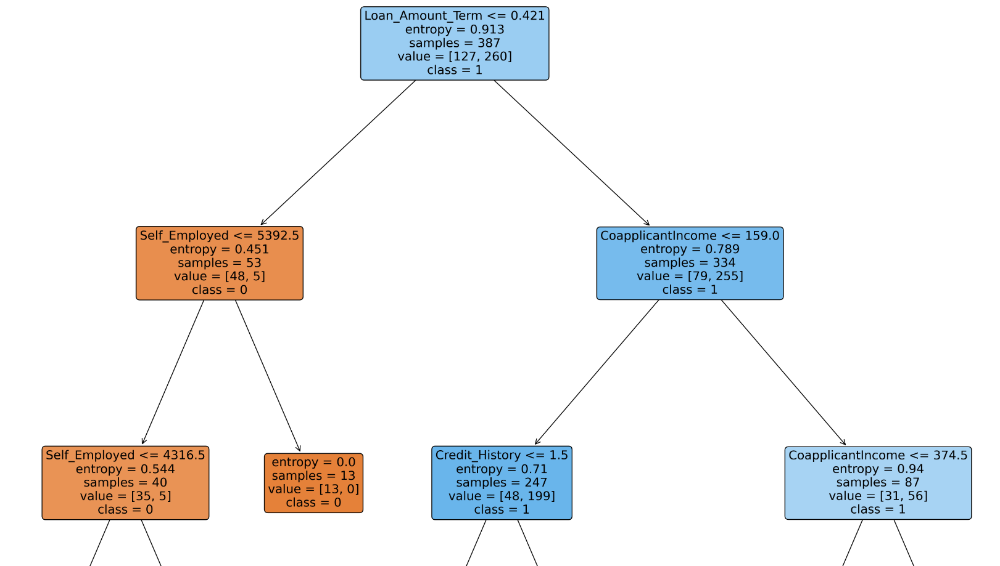

# **Loan Approval Prediction** 🚀

## **Overview** 📋

The **Loan Approval Prediction** system uses machine learning to streamline and optimize the loan approval process. By analyzing key factors like income, credit history, and loan amount, this system predicts an applicant's eligibility, saving time and reducing risks for financial institutions.  

This project builds and trains a machine learning model on historical data to deliver accurate predictions, ensuring efficient and equitable outcomes.  

---

## **Features** ✨  

- 🏦 **Automated decision-making:** Simplifies the loan approval process for banks.  
- ⏳ **Fast and priority-based processing** of applications.  
- 🔐 **Secure predictions:** Protects applicant data and confidentiality.  
- 🔄 **Seamless integration:** Can be embedded into existing banking workflows.  

---

## **Workflow** 🛠️  

### **1. Data Collection** 📊  
- The dataset contains features like **Gender**, **Marital Status**, **Education**, **Income**, **Loan Amount**, and **Credit History**.  
- Example input: Applicant details including dependents, credit score, and loan tenure.  

**📌 Visualization:** Add a sample dataset schema or table here.

---

### **2. Data Preprocessing** 🧹  

- **Cleaning:** Handles missing values and removes irrelevant data.  
- **Normalization:** Scales numerical data for consistent model performance.  
- **Feature Encoding:** Converts categorical data (e.g., Gender) into numerical format.  

```python
# Sample preprocessing code
import pandas as pd
df = pd.read_csv("loan_approval_dataset.csv")
df.fillna(df.median(), inplace=True)  # Fill missing values with the median
df['Credit_History'] = df['Credit_History'].astype(int)  # Convert to proper data type
```

**📌 Visualization:** Add a pipeline diagram showing the preprocessing workflow.  

---

### **3. Feature Engineering** 🧠  

- Features with the highest impact on loan approval are selected using statistical methods like **information gain**.  
- Data is normalized to ensure consistency across features.  

**📌 Visualization:** Add a bar chart showing feature importance based on the decision tree analysis.  

---

### **4. Model Training** 🤖  

- **Algorithm Used:** Decision Tree Classifier.  
- The model creates a hierarchical structure for classification, generating **IF-THEN rules** for interpretable predictions.  

```python
# Decision Tree Classifier example
from sklearn.tree import DecisionTreeClassifier
from sklearn.model_selection import train_test_split

X = df.drop("Loan_Status", axis=1)  # Features
y = df["Loan_Status"]  # Target
X_train, X_test, y_train, y_test = train_test_split(X, y, test_size=0.3, random_state=42)

model = DecisionTreeClassifier(max_depth=5, random_state=42)
model.fit(X_train, y_train)
```

### **5. Prediction and Results** 🔍 

- **New Applicant Evaluation:** The model predicts eligibility for new applicants.  
- **Performance Metrics:**  

| Metric      | Score |
|-------------|-------|
| **Accuracy**  | 90%   |
| **Precision** | 87%   |
| **Recall**    | 85%   |

**📌 Visualization:** Add a confusion matrix or performance chart here.  

---

## **Technologies Used** 🛠️  

- **Programming Language:** Python  
- **Libraries:**  
  - `pandas`, `numpy` for data processing  
  - `matplotlib`, `seaborn` for visualization  
  - `sklearn` for machine learning  

---

## **Results and Visualizations** 📈  

### **Performance Highlights**  
The Decision Tree model achieved:  
- High accuracy (90%)  
- Strong precision and recall (87% and 85%, respectively)  

**Decision Tree Visualization:**  
  
  

---

## **Conclusion** ✅  

This **Loan Approval Prediction** system improves loan processing efficiency by:  
1. Delivering fair and objective decisions.  
2. Reducing manual workloads for bank employees.  
3. Offering faster, data-driven services for applicants.  

**Final Result Visualization:**  
  

---

## **Future Enhancements** 🔮  

- **Expand model portfolio:** Implement Random Forest and Gradient Boosting for comparative analysis.  
- **Real-time data:** Incorporate dynamic data updates to enhance model accuracy over time.  
- **Improved visualizations:** Develop advanced tools for better interpretability.  

---
